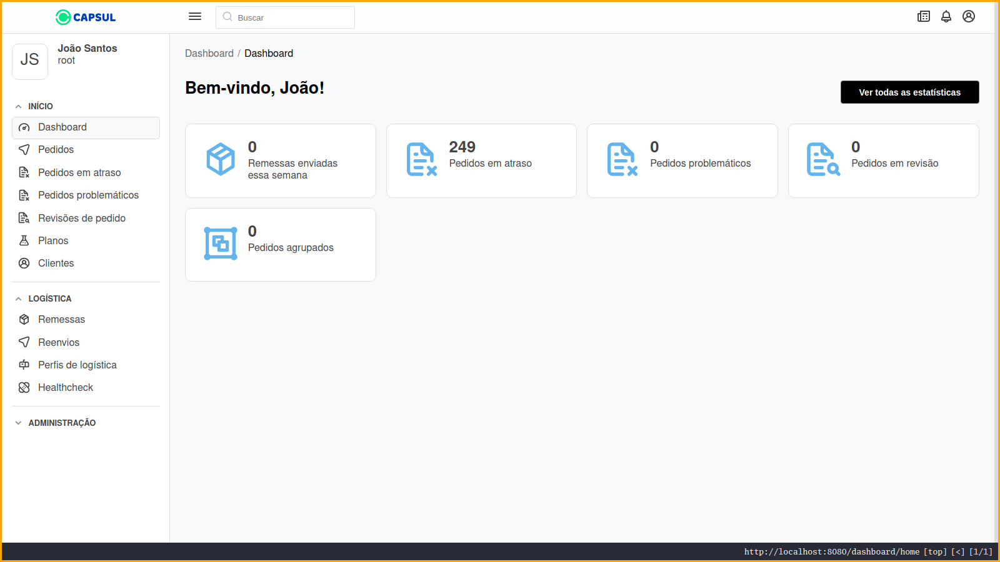

# Savitri Awesome

Savitri is the visual layer which extends the [Semantic API](http://github.com/semantic-api/semantic-api) REST framework. It has a growing community of brilliant developers who care of crafting the better possible experiences while maintaining the codebase tiny. It also borrows all the power from the Vue ecossystem, making your imagination the only barrier.

## Pull requests

You're free to PR an awesome thing you made with Savitri. We'll review it and accept within no time.

## Contents

- [Commercial use](#commercial-use)

## Commercial use

### Capsul Logistics

Capsul is a brazilian nutraceutical industry which takes part in both secondary sector producing high quality healthy products, and in the terciary coordenating an immense team of marketing and support collaborators. It's critical infrastructure system (product logistics, consumer and partner support) alongside with some other minor systems are made on top on Semantic API instances with Savitri running on the frontend edge.

> The collaborators have reported a huge efficiency gain mainly due to the smoother usage experience (thanks for minimal bundle sizes and high speed of SPA applications) and small time taken to implement new features

